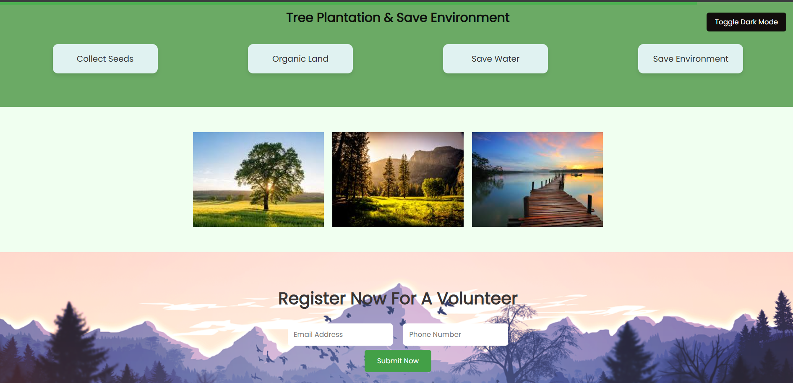

# 🌿 Nature First – Environmental Awareness Web Page 🌳

Welcome to **Nature First**, a beautifully crafted single-page website built with pure HTML and CSS. This project is centered around **raising awareness about nature, trees, and environmental preservation**. Every section—from typography to imagery—has been designed to reflect the calming and essential presence of nature in our lives.

---

## 📌 Project Highlights

- 🌳 **Eco-Centric Theme**: All content emphasizes sustainability, environmental awareness, and the beauty of trees and nature.
- 🎨 **Minimalistic & Clean Design**: Built using only HTML and CSS for simplicity and lightning-fast performance.
- 🖼️ **Embedded Image Using Base64**: A tree-themed image is embedded directly using Base64 to ensure offline compatibility and eliminate external dependencies.
- 💬 **Motivational Quotes**: The footer includes inspirational content to emotionally engage visitors and promote green thinking.
- 📱 **Responsive Layout**: Works smoothly across different screen sizes and devices (can be extended further).
- ⚡ **No Dependencies**: No JavaScript, no frameworks – just clean, semantic code.

---

## 🔧 How It Works

This is a simple HTML/CSS project. All files are self-contained, making it easy to run on any modern web browser.

### 🔗 To Run the Project:
1. Clone the repository or download the HTML file.
2. Open the `index.html` file in your browser.
3. Enjoy the nature-inspired UI!

---

### Why Base64?

- ✅ **Zero HTTP Requests**: The image is embedded right inside the HTML, so no additional file loading is required.
- ⚡ **Faster Rendering**: Reduces delays caused by external image requests.
- 📦 **Self-Contained Page**: Everything you need is in a single file – perfect for demonstrations or offline use.
- 🌍 **Eco-Friendly Messaging**: The tree image supports the central theme of nature preservation.

### Embedded Section Code:

```html
<section class="gallery">
  
</section>


✨ What Makes This Project Special?
💡 Promotes green awareness using digital media.

🌱 Uses minimal code to maximize the impact of natural visuals.

🎯 Great for portfolios, nature blogs, eco-friendly campaigns, or educational content on climate change and sustainability.

📖 Fully readable and editable code for beginners learning how to structure meaningful web content.

---

📸  Preview




---
💚 Contribute
Want to help make this more interactive or add your favorite environmental quote? Contributions are welcome!


🌟 Final Words

Let's build a greener web and a cleaner planet – one line of code at a time! 🌍💻🌲


